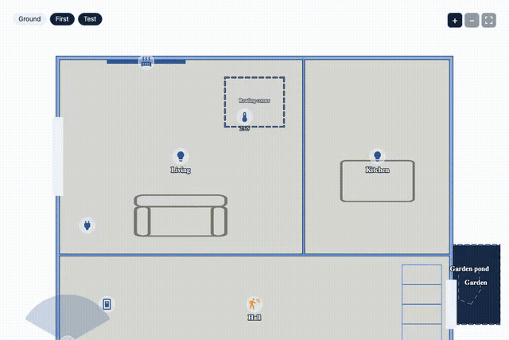

# ha-floorplan-studio

Draw your home inside Home Assistant, attach your devices, use it as a live
dashboard. No external drawing tool, no YAML per element.

Status: usable, still young. The editor, the card and the HA integration are
built, tested and installable through HACS (see `CHANGELOG.md` for the current
release). Organising your home from the plan (Sprint 4) is not built yet.
See `docs/SPEC.md` and `docs/PLAN.md`.



| Part | State |
|---|---|
| Core: schema v2, v1 migration, geometry, SVG renderer, icons | done |
| Editor (standalone `dist/editor.html`, works from `file://`, offline) | done |
| Zones, water, wall kinds, floors, draw mode | done |
| Stairs, gardens, plan rotation, colours, HA names, closed walls to rooms | done |
| Lovelace card (themes: blueprint, light, Home Assistant) | done; its script is served by the integration, and it is not yet seen on a dashboard by eye |
| HA integration, panel, pickers, HACS releases | done, running on the author's Home Assistant |
| Organise: areas, helpers, groups, automations from the plan | Sprint 4 |
| Skill and schema for LLMs, validator (`scripts/validate-layout.mjs`) | done, pulled forward from Sprint 5 |
| Docs (`docs/schema.md`, [`docs/card.md`](docs/card.md), [`docs/editor.md`](docs/editor.md), `CONTRIBUTING.md`) | done |

## What you get

- An editor panel in HA: draw floors, rooms, walls, doors, windows, stairs,
  furniture. Attach rooms to areas and devices to entities from pickers.
- A dumb light on a smart switch is one icon: bind the switch to the light
  ("Controlled by") and the plan shows both as one lamp.
- A Lovelace card: lights, switches, sensors, cameras, thermostats and doors
  shown live. Motion fades from red to grey; open doors turn orange.
- A skill that turns photos of your architect's plans into a first draft.

## Install

[](https://my.home-assistant.io/redirect/hacs_repository/?owner=vespassassina&repository=ha-floorplan-studio&category=integration)

The button opens HACS on your Home Assistant with this repository ready to add. It needs HACS installed, and a published release. Or by hand:

1. HACS → Integrations → add this repository → install, then restart Home Assistant.
2. Add the integration: [](https://my.home-assistant.io/redirect/config_flow_start/?domain=floorplan_studio) (one click, no fields). Home Assistant does not load a custom integration until it has an entry, so this step cannot be skipped.
3. Open **Floorplan Studio** in the sidebar and draw, or load a draft (below).
4. Add the card: `type: custom:floorplan-studio-card`. No resource to add; the integration does it.

The sidebar link is on by default. To hide it: Settings → Devices & services → Floorplan Studio → Configure → turn off **Show in the sidebar**. The card and your saved plan keep working; turn it back on any time.

Updates arrive through HACS like any other.

## Start from photos or architect drawings

Give an AI assistant your drawings, it gives you back a `layout.json`, you open it in the editor and fix what is off. No drawing the outside walls by hand.

It works from a **skill** and a **schema**, two files any assistant can follow (Claude, ChatGPT, Gemini, Grok, Copilot):

- [`prompts/SKILL.md`](prompts/SKILL.md): what to do, in order. It asks you for one real measurement and where north is, then draws, then checks its own work.
- [`prompts/SCHEMA.md`](prompts/SCHEMA.md): the file format, written for an assistant to read.
- [`prompts/examples/`](prompts/examples/): a flat and a two-floor house, both valid.

**How to load them into your assistant, step by step: [`prompts/README.md`](prompts/README.md).**

To check what an assistant gave you, run `node scripts/validate-layout.mjs layout.json`. It prints `ok`, or one line per problem: metres written as centimetres, a room outside the walls, a door on no wall.

## Develop

```bash
npm ci
npm run lint        # eslint and tsc
npm test            # unit tests
npm run build       # dist/ and custom_components/floorplan_studio/www/
npx playwright test # editor tests; PW_PORT=5400 to run beside another checkout
```

Open `dist/editor.html` in a browser to use the editor with no server.
Work is split in tasks (`docs/PLAN.md`), run with the three-role flow (Sonnet executes and verifies, Opus decides) in
`docs/WORKFLOW.md`. Decisions are in `docs/DECISIONS.md`. Notes for AI
assistants working on the code are in `CLAUDE.md`. Contributing by hand: see
[`CONTRIBUTING.md`](CONTRIBUTING.md). The layout format itself:
[`docs/schema.md`](docs/schema.md).

## Licence

MIT. Icons are Material Design Icons (Apache 2.0).
