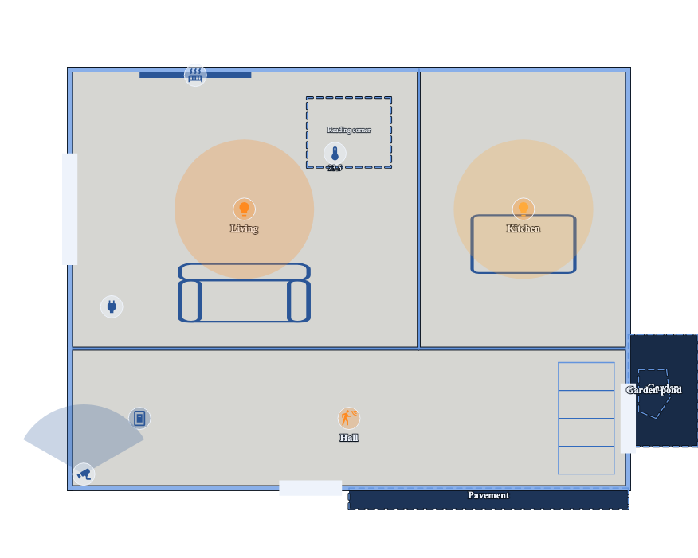

# The card

`custom:floorplan-studio-card` draws one floor of your plan as a live Lovelace
card: rooms, walls, stairs, furniture and every device you attached to a Home
Assistant entity, in one glance, at scale.



## Adding it to a dashboard

Nothing to install by hand — the integration serves the card's script to every
dashboard. Add the card by its type:

```yaml
type: custom:floorplan-studio-card
```

With no other keys it draws your plan's floors as a switcher — one chip per
floor, the first one shown — when your plan has more than one; with only one
floor there is nothing to switch, so it just draws that. Either way: the
`blueprint` theme, motion fading over 300 seconds, `room_glow` off, darker
after sunset.

The editor itself can write this for you: File, Install code opens a panel
with a whole dashboard, matching your plan as it currently stands — theme,
floors — ready to paste. See "A premade dashboard" below.

## Config keys

| Key | Default | What it does |
|---|---|---|
| `floor` | the switcher, if the layout has more than one floor; its only floor otherwise | which floor to pin to, by its id (`ground`, `first`, ...) — no switcher, just that floor; `all` shows the switcher explicitly; an id the layout doesn't have is treated the same as leaving `floor` unset |
| `floors` | unset | an array of floor ids: shows a switcher over only these floors, in this order, defaulting to the first one. Takes precedence over `floor`. An id the layout doesn't have is dropped; if none of them match, this is the same as leaving `floors` unset |
| `theme` | `blueprint` | `blueprint`, `light`, `midnight`, `slate`, `terminal`, `solarized`, or `ha` (see Themes, below) |
| `fade` | `300` | seconds a motion sensor takes to fade from red to grey after it last went off |
| `room_glow` | `false` | tint a room's fill when any light inside it is on |
| `zoom` | `true` | pinch, drag and double-tap on a phone; Ctrl/Cmd+wheel and drag on a desktop; +, − and fit buttons top right. Fit to 8×. `"wheel"` also zooms on a plain wheel (the dashboard then does not scroll over the plan). At fit a vertical swipe over the plan scrolls the dashboard; zoomed in, it pans the plan. `false` fixes the plan and gives every touch back to the page |
| `night` | `auto` | `auto` darkens the plan after sunset (see Night, below); `on` always, `off` never |
| `sun` | `sun.sun` | the entity `night: auto` reads: `below_horizon`, or `on` for a binary sensor, is night |
| `kiosk` | `false` | `true` shows only the plan, nothing else — see Kiosk mode, below |

```yaml
type: custom:floorplan-studio-card
floors:
  - ground
  - first
fade: 300
room_glow: true
theme: blueprint
zoom: true
kiosk: false
```

## Size

The card fills whatever space a dashboard gives it and never crops the plan.

In the sections layout, the card's resize handle starts at a row count taken
from your plan's own aspect ratio, and dragging it taller or shorter
letterboxes the plan (empty space above and below, or left and right) rather
than cutting it off. It won't go narrower than 6 columns or shorter than 3
rows, so the plan stays legible.

In the masonry layout, the card sizes to the plan's aspect ratio at the
column's width, as before.

## Kiosk mode

`kiosk: true` is for a tablet fixed to a wall: nobody there should be able to
switch floors, zoom out past what fits, or reach Home Assistant's more-info
dialog by holding a finger on a device. It hides the floor chips and the
zoom +/−/fit buttons, and a long press does nothing — a plain tap still
toggles the device it lands on, exactly as without kiosk mode.

`kiosk: true` shows the first floor and draws no switcher whatever would
otherwise have produced one — `floors`, `floor: "all"`, or simply a
multi-floor plan with neither key set — since there is nothing to switch
with. For several floors on one wall tablet, use one card per floor
instead — for example a view with a tab per floor:

```yaml
title: Floorplan
views:
  - title: Ground floor
    path: ground
    cards:
      - type: custom:floorplan-studio-card
        floor: ground
        kiosk: true
  - title: First floor
    path: first
    cards:
      - type: custom:floorplan-studio-card
        floor: first
        kiosk: true
```

## The Edit-card form

No YAML needed: adding or editing the card in the Lovelace UI (the pencil
icon, or "Edit" on an existing card) shows a form instead of raw code —
theme, a Floor selector, fade, room glow, zoom, kiosk, night and the sun
entity. The Floor selector picks "All floors (switcher)" (the default — it
writes no `floor` key at all) or one specific floor, by name, once the
card's own layout has loaded (`layout`, `layout_url`, or the plan stored in
Home Assistant); until then it offers only "All floors". Choosing a single
floor there hides the "Switcher shows" checkboxes below it (they would do
nothing) and drops any `floors` list from the config; choosing "All floors"
brings them back. The checkboxes themselves narrow the switcher to only the
ticked floors, in the layout's own order, defaulting to every floor when
none are ticked. A field left at its default is left out of the saved YAML,
so the card config stays as short as if you had typed it by hand.

## A premade dashboard

To get a whole dashboard rather than one card: in the editor, File, Install
code. It shows a dashboard — one view, this card, your plan's current theme
and floors — ready to paste as-is:

```yaml
title: Floorplan
views:
  - title: Floorplan
    path: floorplan
    cards:
      - type: custom:floorplan-studio-card
        theme: blueprint
        floors:
          - ground
          - first
```

Settings, Dashboards, Add dashboard, New dashboard from scratch, then its ⋮
menu, Edit in YAML, and paste this over what's there. To add the card to a
dashboard you already have instead, paste only the `cards:` entry into an
existing view.

## Themes

Seven themes, chosen with `theme:` — never by your dashboard's own light/dark
mode, which the card ignores.

- **`blueprint`** (default) — dark blue ground, cool white linework, a
  terminal-green measurement grid, one saturated orange for anything "on".
- **`light`** — the paper-and-ink set: light ground, dark ink.
- **`midnight`** — the project's original dark theme, kept under its own name.
- **`slate`** — light neutral grey, dark ink, burnt-orange accent.
- **`terminal`** — near-black, terminal green throughout, amber accent.
- **`solarized`** — the real Solarized dark palette; unlike the others, each
  device type keeps its own Solarized hue instead of collapsing to one accent.
- **`ha`** — inherits your dashboard's own theme variables (background, text,
  secondary background for rooms) instead of a fixed palette. Falls back to
  `light` or `midnight` (by `hass.themes.darkMode`) for anything your
  dashboard's theme doesn't define.

## What a device looks like, on and off

Every device sits on a white disc, above rooms and their names. An idle
device is grey; an active one takes its type's own colour — one
`--fp-dev-<type>` accent per type. A handful of types behave a little
differently:

- **Light** — grey when off; on, it turns amber (or the bulb's own colour, if
  it reports one) and grows a soft aura on the plan. Tap toggles it; a long
  press opens Home Assistant's more-info dialog.
- **Light with a bound switch** — one icon that lights up if either the light
  or its switch is on. Tap always toggles the light itself.
- **Motion sensor** — red the moment it triggers, fading back to grey over
  `fade` seconds from when it last went off — even if it's already off by the
  time the card loads.
- **Camera** — a dark cone of view, turned to match the device's own
  rotation.
- **Person** — a green icon at full opacity while home; away (`not_home`, or
  any zone) it dims to 35% with a small grey "away" mark. Point `entity` at a
  `person.*` or `device_tracker.*` entity. Optionally point the device panel's
  Room sensor field at a second entity — a BLE room-presence sensor such as a
  Bermuda or ESPresense area sensor — whose state, or `area_id`/`area`
  attribute, names one of your rooms; the icon then glides there over 600 ms
  each time the sensor changes, and several people in the same room spread on
  a ring instead of stacking. No room sensor, or one that names no room on
  the plan, leaves the icon where you placed it. Tap always opens more-info,
  never a toggle.
- **Radar (mmWave presence)** — a purple icon while its presence entity is on,
  plus one small dot per tracked target, turned by the device's own `rot` (0
  is "ahead is screen-up"). Point `entity` at the presence binary sensor, and
  each `targets` pair at that target's own x/y sensors — an ESPHome LD2450
  gives one x/y pair per target it can track, named by its own YAML:

  ```yaml
  # ESPHome, an LD2450 on a UART: exposes an occupancy binary sensor and, per target
  # (1 to 3, one block each), the x/y sensors floorplan-studio's device.targets wants.
  binary_sensor:
    - platform: ld2450
      has_target:
        name: "Office radar occupancy"
        id: office_radar_occupancy

  sensor:
    - platform: ld2450
      target_1:
        x:
          name: "Office radar target 1 x"
          id: office_radar_t1_x
        y:
          name: "Office radar target 1 y"
          id: office_radar_t1_y
  ```

  In the device panel, `entity` is `binary_sensor.office_radar_occupancy`, and
  the first `targets` pair is `sensor.office_radar_target_1_x` /
  `sensor.office_radar_target_1_y` (Home Assistant's own generated entity ids
  for the `name`s above — repeat the `target_2`/`target_3` blocks and add a
  pair each for more than one tracked person).
- **Cover on a door** — an open door draws orange; tapping it asks before
  opening or closing.
- **Vacuum** — grey while docked, idle or paused; a teal icon while cleaning,
  its icon spinning slowly; teal, not spinning, while returning to dock; and
  `--fp-danger` red on an error state, neither on nor off. A tap opens a
  dialog with Start, Pause and Return to dock, each a plain `vacuum.*` service
  call on the device's own `entity` — no toggle, so a stray tap never starts
  or stops a robot by accident. Point `entity` at the vacuum's own
  `vacuum.*` entity; there is no field for its position or map, since most
  vacuum integrations expose that as a camera entity or a proprietary blob,
  not a pair of coordinates a plan could place. `unavailable` or `unknown`
  still opens the dialog, with Start, Pause and Return to dock disabled and
  Cancel enabled, so an unreachable vacuum can always be dismissed.
- **Unavailable or unknown** — dims to 45% opacity, in any state, with no
  strikethrough: Home Assistant's own dashboards dim rather than cross out,
  and a struck-through icon this small reads as noise, not signal.

The full type-by-type table — idle look, active look, exact colour token,
what a tap does — is in [`SPEC.md`, "Card behaviours"](SPEC.md#card-behaviours).

## Furniture and rooms

A piece of furniture with no entity is a plain grey silhouette — decoration.
One with an entity takes the same amber "on" accent as a device when its
entity is on, open or playing.

A custom room (no Home Assistant area, drawn free-hand) can carry its own
`entity` too: its outline lights up while that entity is on, open or playing,
its fill never moves. A room linked to an *area* instead reflects every
device placed inside it — that's what `room_glow` tints.

## Night

After sunset the plan darkens: every room, the garden, pavement and pond
included, gets a dark blue veil. A room with a light on inside it stays
clear, so at a glance you see where the lights are. It uses the same test as
`room_glow`: a light counts for the room its icon stands in. Walls, names and
icons stay on top, unveiled.

With `night: auto` (the default) the card reads `sun.sun`, which Home
Assistant has out of the box. No sun entity, or an unavailable one, means day.
Point `sun` at another entity to decide yourself, for instance a binary
sensor that is `on` when it is dark. `night: off` turns it off for good. In
the editor, View, Preview night shows the look; the editor has no live
lights, so every room is dark there.

## Troubleshooting

- **Nothing draws.** Check the integration is installed and a layout has been
  saved from the editor at least once (File → Save inside Home Assistant, not
  the standalone download).
- **A device stays grey.** Confirm its entity id in the editor's device panel
  — an empty or unknown entity id always reads as unavailable.
- **The theme looks wrong on `ha`.** Your dashboard's own theme may not
  define every variable the card reads; it falls back to `light`/`midnight`
  per variable, so a partial theme can look mixed. Pick a fixed theme instead
  if that bothers you.
