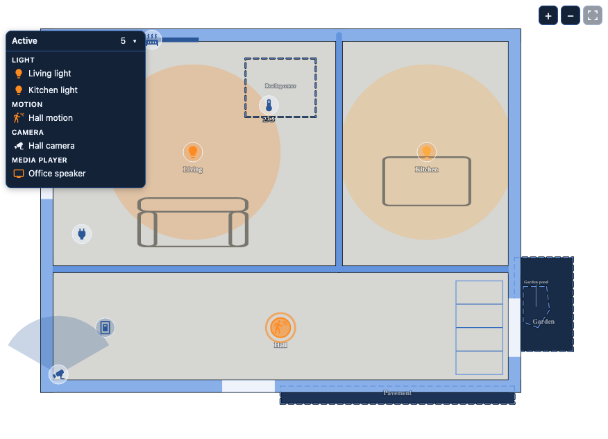
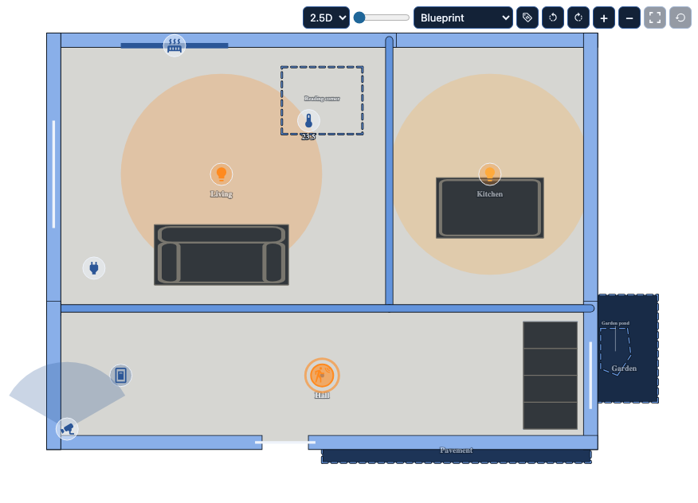
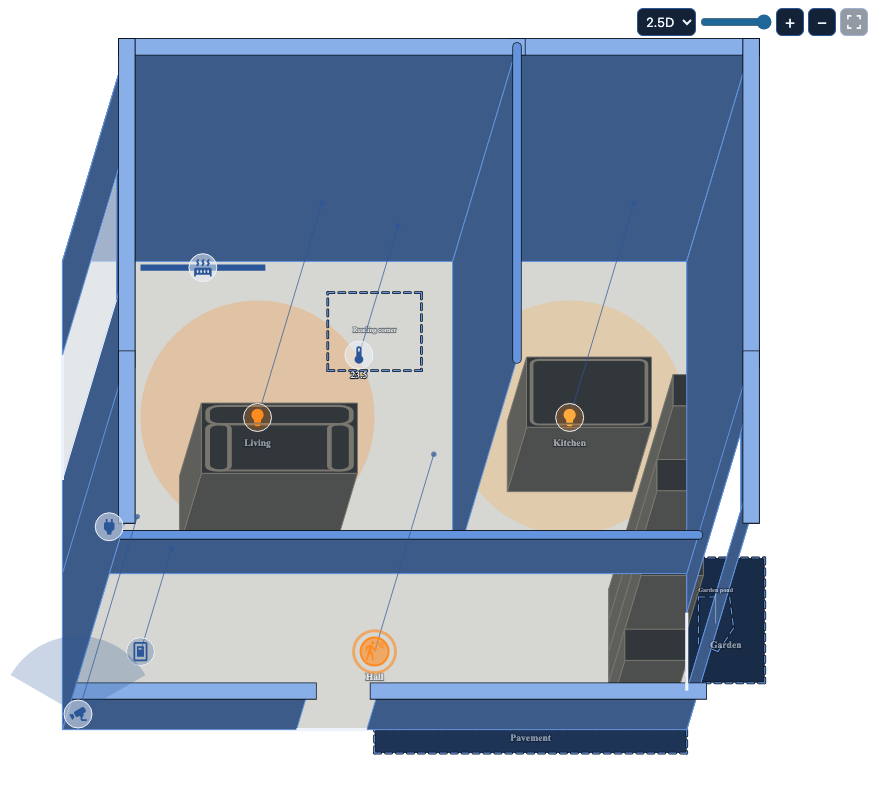
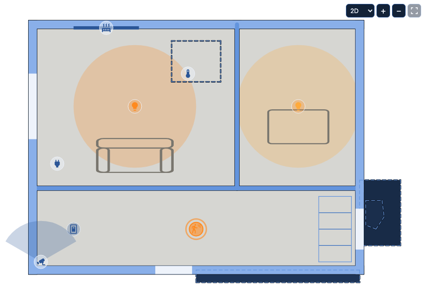
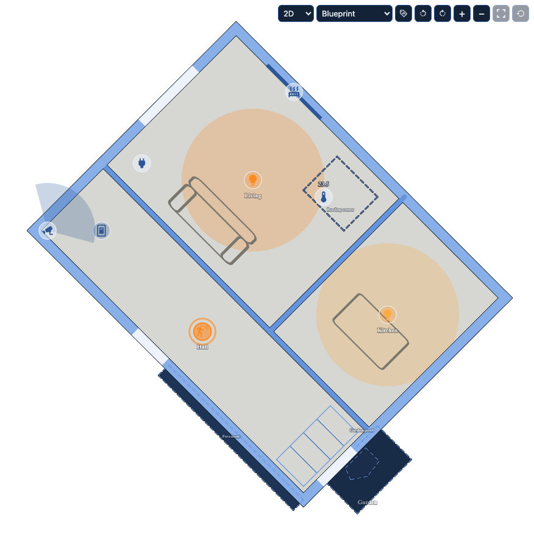

# The card

`custom:floorplan-studio-card` draws one floor of your plan as a live Lovelace
card: rooms, walls, stairs, furniture and every device you attached to a Home
Assistant entity, in one glance, at scale.



## Adding it to a dashboard

Nothing to install by hand — the integration serves the card's script to every
dashboard. (The card is one file plus one more, `floorplan-studio-3d-<hash>.js`,
the 3D view, which the browser fetches only the first time someone picks 3D.
HACS delivers both. If you ever copy `www/` by hand, copy both.) Add the card by its type:

```yaml
type: custom:floorplan-studio-card
```

With no other keys it draws your plan's floors as a switcher — one chip per
floor, the first one shown — when your plan has more than one; with only one
floor there is nothing to switch, so it just draws that. Either way: the
`blueprint` theme, motion fading over 300 seconds, `room_glow` off, darker
after sunset.

The editor itself can write this for you: File → Install code opens a panel
with a whole dashboard, matching your plan as it currently stands — theme,
floors — ready to paste. See "A premade dashboard" below.

## Config keys

| Key | Default | What it does |
|---|---|---|
| `floor` | the switcher, if the layout has more than one floor; its only floor otherwise | which floor to pin to, by its id (`ground`, `first`, ...) — no switcher, just that floor; `all` shows the switcher explicitly; an id the layout doesn't have is treated the same as leaving `floor` unset |
| `floors` | unset | an array of floor ids: shows a switcher over only these floors, in this order, defaulting to the first one. Takes precedence over `floor`. An id the layout doesn't have is dropped; if none of them match, this is the same as leaving `floors` unset |
| `theme` | `blueprint` | `blueprint`, `light`, `midnight`, `slate`, `terminal`, `solarized`, or `ha` (see Themes, below) |
| `fade` | `120` | seconds a motion sensor takes to fade from red to nothing after it goes off |
| `plug_heat_from`, `plug_heat_to` | `0`, `2000` | the draw range a plug's colour runs over, in watts: blue at the low end, amber half way, red at the high end. Two numbers with from below to; anything else is `0` and `2000`. See Plugs |
| `plug_watts` | `2` | a plug is active from this many watts of measured power, not merely while switched on — see Plugs, below. A number `0` or more; anything else is `2` |
| `room_glow` | `false` | tint a room's fill when any light inside it is on |
| `zoom` | `true` | pinch, drag and double-tap on a phone; Ctrl/Cmd+wheel and drag on a desktop; +, − and fit buttons in the vertical stack at the top right, under the toolbar. Fit to 8×. `"wheel"` also zooms on a plain wheel (the dashboard then does not scroll over the plan). At fit a vertical swipe over the plan scrolls the dashboard; zoomed in, it pans the plan. `false` fixes the plan and gives every touch back to the page |
| `night` | `auto` | `auto` darkens the plan after sunset (see Night, below); `on` always, `off` never |
| `sun` | `sun.sun` | the entity `night: auto` reads: `below_horizon`, or `on` for a binary sensor, is night |
| `view` | `2d` | `2d` draws the flat plan, `2.5d` draws it with depth (see 2.5D view, below), `3d` draws it as a real 3D model you can turn (see 3D view, below). Anything else is `2d` |
| `view_switch` | `true` | `false` hides the View dropdown, Theme, Labels and Device names in the toolbar. `kiosk` hides them too |
| `rotate_switch` | follows the other controls | the two rotate buttons and the Left/Right keys. Unset: shown on every card that draws zoom or the View controls, hidden under `kiosk` and on a card with `zoom: false` and `view_switch: false`. `false` hides them, `true` shows them even under `kiosk` |
| `names` | `false` | `true` writes every device's name under its icon, the studio's Names toggle. The Device names button (`Aa`) changes it for as long as the card is on screen |
| `tilt` | `0.5` | how steeply 2.5D looks down, `0` (top-down, no lift, reads as 2D) to `1` (side-on). A number outside that clamps; anything else is `0.5`, the look before this key existed. Only read in 2.5D, and the control is hidden in 3D. See the Tilt slider, below |
| `detail` | `auto` | how much of the plan is drawn at each zoom (Detail, below): `auto` follows the zoom, `full` always draws everything, `minimal` always draws only rooms and what needs attention. Unset or anything else is `auto`, but `full` where the viewer can neither zoom nor reach the Detail button (kiosk, or `active_list: false` with `zoom: false`). The Detail button in the Overview changes it for one viewer, and a viewer's own pick wins over this key |
| `walls` | `cut` | how 2.5D and 3D draw wall heights: `full` every wall at its real height, no cutaway; `cut` the doll's house look, walls facing you lowered so the rooms show; `low` every wall at the cutaway height. Anything else is `cut`. Read in 2.5D and 3D. See Walls, below |
| `labels` | `true` | `false` hides every name and value on the plan (rooms, zones, structures, device names, sensor values), so only icons and state are left. Anything but `false` shows them |
| `rotation` | `0` | degrees the plan starts turned, in steps of 45: `0`, `45`, `90` ... `315`. Any other number rounds to the nearest step; anything that is not a number is `0`. Text and icons stay upright. A viewer's own turn is remembered over this — see View memory and reset, below |
| `kiosk` | `false` | `true` shows only the plan, nothing else — see Kiosk mode, below |
| `open_color` | red | `#rrggbb`: colours an open door or window, or a door whose vibration sensor triggered (and either one's pulsing alert line), instead of red. An invalid value is ignored |
| `icon_size` | `1` | grows icons, names, values and radar dots by this factor, on top of the automatic scale-up on a large plan (see Size, below). A number from `0.5` to `3`; anything else clamps into that range, and a missing or non-numeric value is the default, `1` |
| `active_list` | `true` | `false` hides the Overview panel — see Overview, below |
| `center` | unset | `[x, y]`, plan cm: the point a pinned card zooms in on — see A card for one room, below. A non-array, wrong length, or non-finite value is ignored, silently, and the card shows the whole floor |
| `zoom_level` | `1` | how far in a pinned card starts: `1` is the whole floor, `2` is half its width and height, and so on up to `8`. Anything other than a finite number is the default, `1`; an in-range-but-odd number (`0`, negative, past `8`) clamps instead of being refused |

```yaml
type: custom:floorplan-studio-card
floors:
  - ground
  - first
fade: 120
room_glow: true
theme: blueprint
zoom: true
kiosk: false
icon_size: 1
active_list: true
```

## Updates

A state change from Home Assistant redraws only what it changes. The card builds the plan the same way every time, then compares it to
what is on screen and rewrites the nodes that differ: the device's icon, and what hangs on it (a lamp's light, its room's glow, the
room badge). Other icons are not replaced, so a fade or a glide runs on the same element. An update that changes nothing writes nothing.

## 2.5D view

`view: 2.5d` draws the same plan with depth: walls rise, furniture becomes
boxes, stairs become steps. The floor itself stays true to the plan, so
rooms, icons and taps sit where they do in 2D; only what stands up is drawn
up and to the right (a vertical oblique projection, seen from the south-west).

Three devices also get a body in 2.5D, beside their icon (which stays the tap
target): a **radiator** (a heater drawn as a bar) is a box 8 cm deep, from 10 cm
up to 70 cm (just under a window sill), tinted orange while heating; a
**speaker** or media player is a 20 x 20 x 30 cm cabinet at its point, with
two round drivers that light while it plays; a **TV** is a flat panel 100 cm
wide and 6 thick on the nearest wall within 150 cm (free-standing, facing you,
when there is none), its screen lit while it is on. `z` on a device moves the
radiator's top and the TV's bottom.

A device's `fx` (the editor's "effect size (%)", 25 to 300, default 100) scales
the effect it draws: a lit lamp's aura, a playing speaker's or media player's
waves, a triggered motion or contact sensor's ring and a siren's rings, in 2D,
2.5D and 3D (a lamp's floor pool and wall light too). A **siren** (any device
whose entity is `siren.*`) that is on sends out two red rings, twice as far as a
speaker's waves, on a thicker line and a faster beat; with reduced motion they
hold still at twice the size. Each type keeps its own base size, so 100 is what
the card drew before the field existed.

In the toolbar a small `View` dropdown switches between `2D` and
`2.5D` for as long as the card is on screen. It keeps your zoom and pan, and a
reload goes back to `view:`. `view_switch: false` removes the dropdown and
`kiosk: true` does too; the configured `view` still applies.

A **Tilt** slider sits beside the dropdown while the view is 2.5D, and
disappears in 2D (and with `view_switch: false` or `kiosk`). Left is top-down,
right is side-on; the middle is the default look. Dragging redraws the plan
only: zoom and pan stay, and like the View pick it is forgotten when the
config changes. The `tilt` key sets where it starts. The near walls are cut
lower as the tilt grows, so a room is as visible at a steep tilt as at the
default; at `0` nothing is lifted, so nothing hides anything.

**Walls** sets how tall the walls are drawn. `cut` (the default) keeps a wall at
its real height unless it faces you or hides a room behind it; those ease down
to the cutaway height, so walls at different angles do not all stand equally
tall, and a plan turned a little shows tall side walls and low front walls.
`full` draws every wall at its real height: nothing is cut, and the near walls
can hide the rooms behind them. `low` draws every wall at the cutaway height
(a wall that is shorter anyway, such as a fence, stays as it is): all equal,
every room visible. One straight wall made of several edges (rooms side by
side along one line) always has one height in `cut`.

In 2.5D a wall face is lit by which way it looks on screen (lit, plain, dim),
with a darker foot and a thin lit top edge; the cap on top is thinner than the
flat wall. A door is a painted leaf (`--fp-door`) and a glass door is glass only while closed:
every contact sensor says off, or a lock says locked. With neither, or any other state, it is a hole. An open door or
window, a lock left unlocked or a vibrating door is red (`--fp-open-door`) on
the face and the frame, as its line is in 2D; closed, unavailable or without a
sensor it is not. A cover left open on a plain door stays orange. A room whose
motion sensor is on draws a thin border just inside its walls in the sensor's
colour, and it fades with the icon over `fade` seconds. A radar counts as a
motion sensor here and in the Active list.

A **Walls** select (Full height, Cutaway, Low) sits next to the Tilt slider
while the view is 2.5D, and goes with it in 2D, with `view_switch: false` and
in `kiosk`. A pick redraws the plan only and the card remembers it (below). The
Edit-card form has the same list; the `walls` key sets where it starts.




`labels: false` is for a card that should show only what is on: no room names,
no zone names, no sensor values, no leader lines. Icons, auras, state, fades
and taps are unchanged. It works in 2D and 2.5D.



- Walls are drawn at their height (250 cm by default). The walls on the
  near, south-facing side of the house are cut down to 90 cm, like a doll's
  house with the front taken off, so they never hide the rooms behind them.
  So is any wall facing north whose lift would cover another room's floor (the
  Hall's north wall over the Living room); a back wall with nothing behind it,
  or only a garden, pavement or zone, keeps its full height. A wall seen
  side-on keeps its height; while you rotate, the cut eases in and out.
  A fence keeps its own height; kerbs and boundary lines stay flat.
- A door is a gap in the wall, a window is a band of glass above its sill, a
  slit window is a band of glass 60 cm high against the ceiling, a
  full-height window is a window from the floor to 40 cm under the ceiling, a
  glass door is glass from the floor, a sealed door is a solid panel, an open
  doorway is a gap with nothing in it (while its sensor trips, a solid alert-colour band fills the gap: no dash, no pulse; in 3D a thin glass-like slab). The
  door line at floor level still shows open, closed and alert.
- Furniture and appliances that no entity runs are boxes with their symbol
  on the lid. Heights come from the layout (`height`) or a default per kind.
- Mount heights (S14.5): a ceiling light hangs at 215 cm, a camera, motion sensor, radar and access point at 205, an air conditioner at 195, a cover motor at 175, a thermostat or temperature sensor at 135; the editor's mount height field shows the preset and a device with its own `z` keeps it. In 3D an icon also stays 25 cm under the top of the walls.
- A device mounted at 100 cm or more (a ceiling light, a camera, a smoke alarm)
  is drawn where it hangs, lifted with the walls, with its light radius, camera
  cone, rings, name and value. A small pin stays on the floor under it, joined by
  a thin stem. Tap the lifted icon; the pin takes no taps. A person, a heater bar
  and anything under 100 cm stay on the floor. A radar's target dots stay on the
  floor too: they are positions in the room.
- Heights are set in the editor's inspector (see `docs/editor.md`).

## A card for one room

`center` and `zoom_level` pin a card to a room, corridor or part of a home
instead of the whole floor, so a dashboard can show several cards, each
zoomed into a different place. `zoom_level` alone zooms in about the plan's
own centre; `center` alone (or `zoom_level` at `1`) changes nothing — a
centre with nothing to zoom into has no effect. `center` is always the plan's
own cm, the same coordinates a room or device sits at, whether or not the
layout is rotated.

The pinned view becomes the card's own "home": a double-tap and the
zoomed-in indicator both return here, not to the whole floor. The Fit button
reads **Home view** on a pinned card, since it no longer fits the whole
floor, and is disabled only when the view is already home — pan or pinch it
away and Home view lights back up. (**Reset view** is a different button, the
last one in the stack: it also drops the remembered turn, view and theme —
see View memory and reset, below.) The − button is never gated by the pin:
it is disabled only once the whole floor is on screen, so a pinned card can
still zoom all the way out to see the rest of the house.

The demo's kitchen sits around plan `(650, 200)` — two cards, one on the
whole ground floor and one pinned to just the kitchen:

```yaml
type: custom:floorplan-studio-card
floor: ground
```

```yaml
type: custom:floorplan-studio-card
floor: ground
center: [650, 200]
zoom_level: 2.5
```

The easiest way to get the two numbers for your own home: open the editor,
zoom and pan to the room you want, then View → **Copy card view**. It copies
the `center:`/`zoom_level:` lines straight from what the editor is showing,
ready to paste into the card's YAML. A pinned card is meant for one floor —
set `floor:` alongside `center`/`zoom_level` if the layout has more than one.

## Size

The card fills whatever space a dashboard gives it and never crops the plan.

In the sections layout, the card's resize handle starts at a row count taken
from your plan's own aspect ratio, and dragging it taller or shorter
letterboxes the plan (empty space above and below, or left and right) rather
than cutting it off. It won't go narrower than 6 columns or shorter than 3
rows, so the plan stays legible.

In the masonry layout, the card sizes to the plan's aspect ratio at the
column's width, as before.

On a plan over 1000 cm on its longest side, icons, names, values and radar
dots stop shrinking with it and grow instead, so they stay legible in a big
house. `icon_size` scales them further on top of that, from half size to
three times, for a plan that still reads small, or a tablet viewed from
across the room.

## Studio and card

The card lays its controls out like the studio: one vertical stack on the plan (+, −, Fit,
rotate left, rotate right, Reset view) under a horizontal toolbar that keeps the look
controls (View, Tilt, Walls, Theme, Labels, Names). On a card too short for the column
the stack lays out as a row under the floor chips.

"Everything you do in the studio you can do in the card", for **viewing**. Each
control of the editor's View menu, its zoom group and its Layers tab, and what
the card does about it. A test (`tests/card/view-parity.spec.ts`) reads the
editor and fails on a control that has no row here, so a new one gets a decision.

| Studio control | In the card | Why |
|---|---|---|
| `#labels` Show names and text | yes | the Labels toggle |
| `#names` Names | yes | the Device names toggle (`Aa`), config `names` |
| `#thSub` Theme | yes | the Theme dropdown |
| `#fit` Fit to window | yes | the Fit button (Home view on a pinned card) |
| `#recenter` Re-center | yes | the same Fit button |
| `#zin` `#zout` Zoom | yes | the + and − buttons, first in the stack, the Up and Down keys, pinch and wheel |
| `#zreset` Reset view | yes | the Reset view button, last in the stack, and Space |
| `#vrotl` `#vrotr` Rotate view | yes | the two rotate buttons in the stack and the Left and Right keys |
| `#version` the installed version | no | the card names its version in the browser console instead |
| `#snap` Snap grid | no | an editing aid: a viewer places nothing |
| `#mgrid` Measure grid | no | an editing aid, drawn by the editor over the plan, not by `renderFloor` |
| `#lens` Lengths | no | an editing aid |
| `#night` Preview night | no | a preview of what the card already does by itself (`night`, `sun`) |
| `#copyCardView` Copy card view | no | authoring: it writes the card's `center` and `zoom_level` |
| `#detailSub` Detail (Auto, Full, Minimal) | yes | the Detail button beside Layers in the Overview, same three choices; kept per viewer; config `detail`. The Studio starts on Full, the card on Auto. Not in 3D |
| `#tabLayers` Layers (hide a family) | yes | the Layers button in the Overview unfolds a text chip per family: a click hides it, Alt-click shows it alone; kept per viewer. Not in 3D |
| Plan view, Tilt, Walls | card only | the View dropdown, the Tilt slider and the Walls select. The studio has no 2.5D since 0.14 (S12.1); the card keeps 2D and 2.5D, and gets 3D |
| Room facts and device details panel | card only | the card's left panel (Picking a room); the studio already has its own selection panel with the room's fields and each device's entity |

Also the same in both: the floor switcher (chips and tabs), pan and zoom by
pointer, the view remembered per browser, and Reset view clearing it. The
editor's other menus (Add, Draw, Edit, File, Help, Undo) change the plan, which
a card does not.

## Kiosk mode

`kiosk: true` is for a tablet fixed to a wall: nobody there should be able to
switch floors, zoom out past what fits, or reach Home Assistant's more-info
dialog by holding a finger on a device. It hides the floor chips and the
zoom +/−/fit buttons and the rotate buttons (`rotate_switch: true` brings
those back), and a long press does nothing — a plain tap still
opens the device's popup, whose button operates it, as without kiosk mode, but the popup has no
**More info** link: nothing in kiosk mode reaches Home Assistant's dialog.

`kiosk: true` shows the first floor and draws no switcher whatever would
otherwise have produced one — `floors`, `floor: "all"`, or simply a
multi-floor plan with neither key set — since there is nothing to switch
with. For several floors on one wall tablet, use one card per floor
instead — for example a view with a tab per floor:

```yaml
title: Floorplan
views:
  - title: Ground floor
    path: ground
    cards:
      - type: custom:floorplan-studio-card
        floor: ground
        kiosk: true
  - title: First floor
    path: first
    cards:
      - type: custom:floorplan-studio-card
        floor: first
        kiosk: true
```

## Overview

A floating panel over the plan, open by default in the top-left. It says what
is wrong before what is on. The header reads "Home › Ground" and counts:
alerts first, then one chip per category ("2 alerts · 6 lights · 1 plug"), or
"Nothing on". Folded, the header is one line and the alerts stay first.

From the top:

- **Search.** ⌘K, Ctrl+K or `/` while the card is focused or under the
  pointer. Type a few letters of a device, room or floor; Enter goes to it.
  Accents do not matter ("soren" finds "Søren"). Escape closes it.
- **Turn off on this floor…** A checklist of what is on, grouped as Lights
  (with the switch that powers them), Switches, Plugs and Media. Everything
  starts ticked; untick what should stay on. "Turn off 4" sends exactly the
  ticked ones. Cancel or Escape sends nothing.
- **Layers.** Unfolds one chip per family on this floor. A click hides the
  family on the plan; Alt-click shows it alone. Kept per viewer, in this
  browser. Not in 3D. Search still finds a hidden device and draws it.
- **All floors.** Lists every floor, each row badged with its floor. By
  default the list shows the floor on show.
- **Attention.** Alarm triggered or armed, open doors and contacts, jammed
  and unlocked locks, leak, smoke and gas, low batteries, each with its age
  ("open · 12 min"). Unavailable devices sit in one folded row with a count.
- **Active.** Lights on (a light bound to a switch counts when the switch
  is), motion and contact on, media playing, heating, plugs drawing
  `plug_watts` or more (see Plugs), computers on, people home, vacuums
  cleaning, garage doors and gates open. Grouped by category; each group
  folds. Cameras are never listed. Something already in Attention is not
  repeated here, except a lamp that is on with a low battery.

A row tap goes to the thing: the plan switches floor, centres on it, rings it
and opens its popup. Device details (model, firmware, area) are under
"Details" in that popup.

Floor tabs count the things that need attention on that floor ("Ground · 3").
A tab turns warning-coloured while an alarm on that floor is triggered.

**Low battery.** A device counts as low under 20 %. The card reads, in
order: the entity itself if it is a battery sensor; its `battery_level` or
`battery` attribute; else a battery sensor on the same Home Assistant device
that HA files as *diagnostic*. ZHA, Zigbee2MQTT, Matter and Shelly do that.
ESPHome does not unless you set `entity_category: diagnostic` in the YAML; or
place the battery sensor as its own icon. Home batteries, inverters, UPSes
and cars never raise it: their charge is a reading, not an alert.

**Position and folding.** Drag the header to move the panel; it stays on
screen when the card resizes. On a card narrower than 480px it starts folded.
Position, fold, scope and the folded groups are kept per card in this browser
(`localStorage`), keyed to the layout's source and the card's own
`floor`/`floors`, so two cards on one dashboard do not share them.

## Picking a room

Tap a room, on its floor, its name, its readout or its furniture (not a device, a
door or a stair), and the room is outlined with a dashed line. The Overview opens at the left with a room section on top:

- the name and a cross that clears the pick;
- area in m², worked out from the room's corners;
- temperature and humidity, the same mean the plan prints under the name;
- motion, on or off, and since when;
- the open doors and windows on the room's walls (an unlocked lock counts), and the lights that are on;
- **Scenes** (S14.7): a button for each Home Assistant `scene.*` entity of the room (dashed border), for each custom scene saved on the
  room, then **Lights off** and **All on**. See below;
- the room's devices, then the sensors the room owns that have no icon on the plan, grouped by the same collapsible categories as the Overview.

**Scenes.** A scene button is one tap, no popup. A Home Assistant scene calls `scene.turn_on`. A scene belongs to the room when its
area is the room's area (the scene entity's own `area_id` in `hass.entities`, else its device's `area_id` in `hass.devices`; the Hue
integration puts its scenes on the Hue room's device, so Hue scenes appear on their own), or when the studio lists it in the room's
`haScenes`. A custom scene is a name and a list of lights and switches, each on or off, a light with an optional brightness (1 to
100 %), colour temperature (K) or colour (`hs`); it calls `light.turn_on` or `light.turn_off` per light and `switch.turn_on` or
`switch.turn_off` per switch, with only the fields it sets. **Lights off** and **All on** are one `light.turn_off` or `light.turn_on` over the lights drawn
in the room. They are lights only, so they do not ask first, the same as a light's popup (S14.2). A custom scene that turns a
switch off asks first: its button turns into **Confirm: name** with a Cancel next to it. A room with no scene and no light shows no
Scenes label. Scenes are in the Room section, so they need the Overview (not `kiosk`, not `active_list: false`).

A tap on a row opens the same popup as the icon on the plan, for every type (a radiator's has only **More info**); a hold opens
Home Assistant's more-info. On a card under 480 px wide the open panel is a short sheet, at most 45 % of the card high with its list scrolling inside, docked on the half of the card away from the picked room. Below, the lists are cut to the room's
entities; **Show all** brings the rest back and keeps the room picked.

Tap the room again, tap off any room, press Escape (with the pointer over the
card or the card focused, as for the view keys) or press the cross to clear it.
Changing floor clears it too. A tap on a device, a door or an appliance keeps its
meaning and never picks a room. A double tap zooms and leaves the pick as it
was. Under `kiosk: true` or `active_list: false`
there is no panel, so a tap picks nothing. On a card under 480 px the panel is
folded by default; it opens while a room is picked.

A device's popup has a folded **Details**: manufacturer, model, firmware, area,
entity id, state and when it last changed, from Home Assistant's device
registry. A device with no registry entry shows the entity id, state and last
changed. Not in kiosk.

## Detail

A house with hundreds of devices is unreadable whole. The card draws less when you are far out and more as you zoom in.
Zoom 1 is the whole floor at fit.

| Level | Zoom | What is drawn |
|---|---|---|
| far | below 1.6 | rooms, room names and room badges; a device that is on, alerting or unavailable stays as a dot, and so does one the Overview lists under Attention (an unlocked or jammed lock, a low battery, an open contact); other idle devices go |
| mid | 1.6 to below 3.2 | device icons, room names and badges; no device names or readings |
| near | 3.2 and up | everything, with device names and readings |

The thresholds are fixed. **Detail** (a button beside Layers in the Overview) picks the mode: **Auto** follows the zoom,
**Full** is always near, **Minimal** is always far. The config key `detail: auto | full | minimal` sets the card's
default (anything else counts as no key; the Edit-card form has a Detail select). With no key the default is `auto`, unless the viewer could not change the level: with `kiosk`, or with `active_list: false` and `zoom: false` (no Detail button, no zoom buttons), it is `full`, so no idle device is out of reach. A key you write always wins, `detail: auto` in a kiosk included. A viewer's own pick is remembered in that
browser and wins over the YAML; Reset view clears it. With storage blocked the pick lasts until the page closes. Live 3D
draws every level.

## View memory and reset

Two buttons in the stack, under the zoom buttons, turn the plan: **Rotate left** and
**Rotate right**, 45 degrees a press. They are their own control (`rotate_switch`):
`view_switch: false` hides the View dropdown, not them. They turn the 2D plan
too; rotation does not need 2.5D. The plan turns smoothly (about 0.35 s a
step, longer for several quick presses, none with `prefers-reduced-motion`);
names and icons stay upright. Pan, zoom and taps wait until it has settled.
The card also has a Theme dropdown and a names-and-text toggle next to View.

The card remembers, per browser, the viewer's zoom, the spot they zoomed to,
the rotation, 2D, 2.5D or 3D, the tilt, the wall heights, the theme, whether
text shows, which layer chips are off and the Detail mode. Come
back, reload or switch dashboard tab and the plan is as it was left, with no
flash of the configured look. The floor and the Overview are remembered
as before.

**Zoom, spot, rotation and the 3D camera are remembered per floor.** Zoom in
on the ground floor, turn the first floor, orbit the 3D model on either:
switch floors and back and each is as you left it. A floor you never touched
shows the config's look (in 3D, the way of looking carried over from the floor
before, framed for itself). Reset view, and Reset camera in 3D, clear the
floor on show and leave the others alone. With storage blocked the floors
still remember until the page closes. Entries written by an older card (one
zoom and turn for the whole card) move to the floor they were saved on.

- **A remembered value wins over the config** for as long as the config is the
  same. Edit `view`, `rotation`, `theme`, `tilt`, `walls`, `labels`, `names`, `detail`, `center`,
  `zoom_level`, the layout source or the floors in the card's YAML and that
  card starts with a clean memory: the new YAML is what you meant.
- **Reset view** (the last button of the stack, greyed while nothing differs) puts
  every one of these back to the card's config and forgets the memory (zoom,
  turn and camera: of the floor on show only). The
  turn goes back the short way round. The floor stays. It is not the Fit
  button: Fit, or Home view on a pinned card, only changes zoom and position.
- **Keys.** The card you hover or have focused listens; another card on the
  page does not. The arrows pan, `+` and `-` zoom (neither with `zoom: false`),
  `[` and `]` turn the plan (when the rotate buttons are there), Space is
  Reset view. The
  keys work with the pointer over the card, no click needed, and after one
  click on it even when the pointer has moved off. The card tracks its own
  focus because in Home Assistant it sits inside several shadow roots, where
  the page's `document.activeElement` is never the card. Nothing fires while
  you type in a field, and Space on a focused button presses that button. Cover,
  vacuum and chooser dialogs take the keys while they are open. Under `kiosk`
  there are no buttons and no rotation keys; the zoom and pan keys still work, as the
  zoom gestures do.
- **When it is saved.** 150 ms after you touch zoom, focus, turn, view, tilt,
  walls, theme, names or floor, and again when the tab is hidden or closed. The
  floor is remembered with the rest, so a reload does not return you to the
  first floor.
- The memory sits in the browser's `localStorage`, under `fp-view:` and a
  short hash of the card's config. It holds numbers, one 2D/2.5D/3D word, a theme
  name and a flag, nothing else. Anything in it that does not parse is
  dropped field by field, and a browser that blocks storage just forgets.
- It is per browser, not per Home Assistant user, and not synced.



## The Edit-card form

No YAML needed: adding or editing the card in the Lovelace UI (the pencil
icon, or "Edit" on an existing card) shows a form instead of raw code —
theme, a Floor selector, fade, the plug watts, room glow, zoom, view, view switch, rotation (with a note that viewers' views are remembered), kiosk, icon size, the
open-door colour (with a Clear button, distinct from picking the theme's
own default colour by hand), the Active list toggle, night and the sun
entity. The Floor selector picks "All floors (switcher)" (the default — it
writes no `floor` key at all) or one specific floor, by name, once the
card's own layout has loaded (`layout`, `layout_url`, or the plan stored in
Home Assistant); until then it offers only "All floors". Choosing a single
floor there hides the "Switcher shows" checkboxes below it (they would do
nothing) and drops any `floors` list from the config; choosing "All floors"
brings them back. The checkboxes themselves narrow the switcher to only the
ticked floors, in the layout's own order, defaulting to every floor when
none are ticked. A field left at its default is left out of the saved YAML,
so the card config stays as short as if you had typed it by hand.

## A premade dashboard

To get a whole dashboard rather than one card: in the editor, File, Install
code. It shows a dashboard — one view, this card, your plan's current theme
and floors — ready to paste as-is:

```yaml
title: Floorplan
views:
  - title: Floorplan
    path: floorplan
    cards:
      - type: custom:floorplan-studio-card
        theme: blueprint
        floors:
          - ground
          - first
```

Settings, Dashboards, Add dashboard, New dashboard from scratch, then its ⋮
menu, Edit in YAML, and paste this over what's there. To add the card to a
dashboard you already have instead, paste only the `cards:` entry into an
existing view.

## Themes

Seven themes, chosen with `theme:` — never by your dashboard's own light/dark
mode, which the card ignores.

- **`blueprint`** (default) — dark blue ground, cool white linework, a
  terminal-green measurement grid, one saturated orange for anything "on".
- **`light`** — the paper-and-ink set: light ground, dark ink.
- **`midnight`** — the project's original dark theme, kept under its own name.
- **`slate`** — light neutral grey, dark ink, burnt-orange accent.
- **`terminal`** — near-black, terminal green throughout, amber accent.
- **`solarized`** — the real Solarized dark palette; unlike the others, each
  device type keeps its own Solarized hue instead of collapsing to one accent.
- **`ha`** — inherits your dashboard's own theme variables (background, text,
  secondary background for rooms) instead of a fixed palette. Falls back to
  `light` or `midnight` (by `hass.themes.darkMode`) for anything your
  dashboard's theme doesn't define.

## What a device looks like, on and off

Every device sits on a white disc, above rooms and their names. An idle
device is grey; an active one takes its type's own colour — one
`--fp-dev-<type>` accent per type. A handful of types behave a little
differently:

- **Light** — grey when off; on, it turns amber (or the bulb's own colour, if
  it reports one) and grows a soft aura, 3 m across, on the plan. A tap opens its popup (Turn on or off, sliders); a long
  press opens Home Assistant's more-info dialog.
- **Light with a bound switch** — one icon that lights up if either the light
  or its switch is on. A tap's button always acts on the light itself; the switch is
  never one of the S10.4 chooser's entities (below) — it stays reachable from
  inside the light's own more-info dialog instead.
- **Motion sensor** — red the moment it triggers, with a strong red disc and
  a ring pulsing out from it while it stays on. It then fades back to grey
  over `fade` seconds from when it last went off — even if it's already off
  by the time the card loads.
- **Motion perimeter** — while a motion sensor (or a radar) stands in a room
  and is on, the room gets one thin solid line just inside its walls, in the
  sensor's own colour (red by default; a radar takes the radar colour). The
  smallest room that holds the sensor gets it, so a house in a garden lights
  the house; with several sensors on in a room the first in layout order
  names the colour. It shows exactly while the sensor is on (the icon's fade
  is separate), in 2D and 2.5D (flat at floor level, under the walls), with
  names off, at night and in every theme. Zones and structures never get one.
  A group of motion sensors works the same through its own entity.
  A room that lists its own `motion` sensors draws the same line, and it pulses
  three times when the sensor trips, then holds steady while the sensor is on
  and fades once it is off. A redraw (any state change on the plan) does not
  replay the pulses. With reduced motion set on the device, it is the steady
  line only. Zones, structures and fills never get one.
- **Cover** — active (orange, on the Active list) only while open, opening or
  closing AND its HA `device_class` is `garage`, `gate` or `door`. Every other
  class (`curtain`, `blind`, `shade`, `shutter`, `awning`, `window`, `damper`),
  and a cover that reports no class, draws idle grey in every state. The class
  is read from the entity's state at draw time; nothing is stored in the layout.
  A room that shows a cover entity follows the same rule. A tap opens its popup
  (Open or Close). A door line with a `cover` draws orange when that cover is open (below).
- **Contact sensor** — open shows the same red disc and pulsing ring. A door
  or window with a contact sensor turns red and dashed when open, over a wide
  pulsing red line; `open_color` recolours both to something other than red.
  With reduced motion set on the device, nothing pulses. A cover door's own
  open state (see Cover, above) is separate: it stays its plain orange,
  undashed, whatever `open_color` says.
- **Vibration sensor** — a door with a vibration sensor attached turns the
  same colour as an open contact (`open_color` applies here too) and gets
  the same pulsing alert line, but the door itself stays solid, not dashed:
  dashed still means "open". A door that is open and vibrating at once
  stays dashed (open wins the dash) and only ever shows one alert line. A
  contact or vibration sensor attached to a door — not placed as its own
  icon — still shows on the Active panel, under the door's own name.
- **Speaker (media_player)** — a fixed blue in every theme (the same
  exception a TV is: a TV or speaker's icon turns blue whenever the player
  reports anything other than off, standby, unavailable or unknown — not
  only its plain `on`, since a Cast, Android TV or webOS device reports
  `playing`/`paused`/`idle` while genuinely powered on), the speaker one
  only while its state is exactly `playing`: paused, idle, off,
  on-but-not-playing, unavailable and unknown all stay idle grey. A plain
  `media` device is a separate type: it keeps each theme's own colour (its
  accent, or Solarized's own magenta — never speaker/TV's fixed blue)
  rather than being fixed itself. Playing, two arcs pulse out from under
  its disc in its own colour, so a speaker mid-song reads as radiating
  sound on the plan. Reduced motion holds the arcs still, the same as a
  motion sensor's ring. The popup has More info only: `media_player.toggle`
  is play/pause or power, never a clean on/off, so guessing which one you
  meant would be worse than always asking.
- **Camera** — a dark cone of view, turned to match the device's own
  rotation.
- **Person** — a green icon at full opacity while home; away (`not_home`, or
  any zone) it dims to 35% with a small grey "away" mark. Point `entity` at a
  `person.*` or `device_tracker.*` entity. Optionally point the device panel's
  Room sensor field at a second entity — a BLE room-presence sensor such as a
  Bermuda or ESPresense area sensor — whose state, or `area_id`/`area`
  attribute, names one of your rooms; the icon then glides there over 600 ms
  each time the sensor changes, and several people in the same room spread on
  a ring instead of stacking. No room sensor, or one that names no room on
  the plan, leaves the icon where you placed it. The popup has More info only,
  never a toggle.
- **Radar (mmWave presence)** — a purple icon while its presence entity is on,
  plus one small dot per tracked target, turned by the device's own `rot` (0
  is "ahead is screen-up"). Point `entity` at the presence binary sensor, and
  each `targets` pair at that target's own x/y sensors — an ESPHome LD2450
  gives one x/y pair per target it can track, named by its own YAML:

  ```yaml
  # ESPHome, an LD2450 on a UART: exposes an occupancy binary sensor and, per target
  # (1 to 3, one block each), the x/y sensors floorplan-studio's device.targets wants.
  binary_sensor:
    - platform: ld2450
      has_target:
        name: "Office radar occupancy"
        id: office_radar_occupancy

  sensor:
    - platform: ld2450
      target_1:
        x:
          name: "Office radar target 1 x"
          id: office_radar_t1_x
        y:
          name: "Office radar target 1 y"
          id: office_radar_t1_y
  ```

  In the device panel, `entity` is `binary_sensor.office_radar_occupancy`, and
  the first `targets` pair is `sensor.office_radar_target_1_x` /
  `sensor.office_radar_target_1_y` (Home Assistant's own generated entity ids
  for the `name`s above — repeat the `target_2`/`target_3` blocks and add a
  pair each for more than one tracked person).
- **Cover on a door** — an open door draws orange; tapping it opens the popup,
  and its button asks before opening or closing.
- **Vacuum** — grey while docked, idle or paused; a teal icon while cleaning,
  its icon spinning slowly; teal, not spinning, while returning to dock; and
  `--fp-danger` red on an error state, neither on nor off. A tap opens a
  dialog with Start, Pause and Return to dock, each a plain `vacuum.*` service
  call on the device's own `entity` — no toggle, so a stray tap never starts
  or stops a robot by accident. Point `entity` at the vacuum's own
  `vacuum.*` entity; there is no field for its position or map, since most
  vacuum integrations expose that as a camera entity or a proprietary blob,
  not a pair of coordinates a plan could place. `unavailable` or `unknown`
  still opens the dialog, with Start, Pause and Return to dock disabled and
  Cancel enabled, so an unreachable vacuum can always be dismissed.
- **Unavailable or unknown** — dims to 45% opacity, in any state, with no
  strikethrough: Home Assistant's own dashboards dim rather than cross out,
  and a struck-through icon this small reads as noise, not signal.

## Plugs

A plug is active only while it draws power: `plug_watts` (default `2`) or
more. A plug switched on and idling at 0.4 W draws grey, is not in the Active
list, and its tooltip says so (`plug: TV plug, 0.4 W`); at exactly 2 W it is
active, at 1.99 W it is not. The reading comes from the plug's `power` sensor
(the `sensor.*` of device class `power`) in the layout. Without one, the card
looks for the plug's sibling at runtime: the one `sensor.*` of device class
`power` that is not a diagnostic entity on the same Home Assistant device,
read from `hass.entities` (a card on an old frontend that does not provide it
simply does not link). Two candidates link nothing: a wrong guess would paint a
plug by another plug's draw, so pick one in the editor. An explicit `power`
always wins.

**Colour by draw (S14.8).** A plug that is active and has a readable power sensor is
tinted by how much it draws: blue at `plug_heat_from` (default 0 W) or less, amber
half way, red at `plug_heat_to` (default 2000 W) or more, in 2D, 2.5D and 3D, in
every theme (the ramp is three fixed tokens, `--fp-heat-cool`, `--fp-heat-mid` and
`--fp-heat-hot`, not the theme's accent). Colour is not the only signal: the plan's
tooltip and the tap popup say the watts (`plug: TV plug, 1500 W`). A plug with no
sensor, an unreadable one, or one that is off keeps its own colour (`--fp-dev-plug`,
or `colors.plug`), as before. Only plugs are tinted; a switch has no `power` field.

What the card does when it cannot be sure:

| Switch | Power sensor | Plug |
|---|---|---|
| off | anything | idle |
| unavailable or unknown | anything | unavailable |
| on | below `plug_watts` | idle |
| on | `plug_watts` or more | active |
| on | unavailable, unknown, not a number, or a unit other than W and kW | active, as before: a flaky sensor does not hide a plug |
| on | none known | active, as before: the card cannot know |

`W` and `kW` are read (kW times 1000); a sensor with no unit counts as W. A
room or a piece of furniture whose `entity` is the plug's switch follows the
same rule for its "on" ring. A light bound to a plug's switch (`bound`) does
not: it is a lamp, and on when its switch is.

## Tap, hold and hover

A tap never operates anything. On a device icon, a door, an unlinked appliance or a row of the Active list,
in 2D and in 3D, it opens a small popup next to the icon:

- the name and one line of state (the same text the hover tooltip and the plan's readouts use: `48 %`, `21.5 °C`,
  a light's brightness as a percent, a cover's position, a plug's watts);
- one primary button, 44 px tall: **Turn on**, **Turn off**, **Open**, **Close**, **Lock** or **Unlock**, a plain
  `turn_on`, `turn_off`, `open_cover`, `close_cover`, `lock` or `unlock` call on the device's own entity;
- a **More info** link, which opens Home Assistant's dialog (or the chooser when the object names several entities).

The popup stays inside the card (on a short card its sliders scroll; the name, the state and the buttons stay in view). Only one is open at a time, across cards too. It also closes when the floor changes or the layout is replaced. It closes on Escape, on a tap anywhere else, or on a
second tap of the same icon. Tapping another icon moves it. It is a non-modal `role="dialog"` named after the device;
focus goes to its primary button and comes back to what opened it. A **hold** (long press) still opens more-info
directly, as before.

- **Turning something OFF asks first**, for every type except a light (a lock and a cover act at once; a media player or speaker has no on/off button): the button turns into **Confirm turn off**
  next to Cancel. Turning ON is immediate. A light's OFF is immediate too. A lock and a cover keep their own
  wording. A door with a `cover` keeps its confirm dialog, opened from the popup's button.
- **A light** with brightness gets a slider (1-100 %); one with colour temperature gets a kelvin slider; one with a
  colour mode (hs, xy, rgb) gets a hue slider. Moving a slider changes only the number shown; releasing it makes the
  one `light.turn_on` call. A light that only switches on and off gets no slider.
- **No toggle** (camera, media player, speaker, battery, inverter, server, access point, person, radar, vacuum):
  name, state and More info only. A vacuum tap still opens its own dialog.
- `tap_action` is not a card option and the popup does not read one.

**A stack of devices.** Devices whose discs overlap on screen (centres closer than 32 px, drawn ones only) are a stack,
and a tap on any of them does not open a popup. It fans the stack out in a ring about its centre: each member moves to
its own spot, a fixed 44 px or more from the next, with a thin line back to its true place, a pin there, and its name
beside it. The ring keeps its size on screen at any zoom and is moved to stay inside the view (a card turned by Rotate
does not move it). A tap on a member in the ring does what a tap on that device does: the popup, a hold for more-info.
**Escape**, or a press anywhere on the plan that is not a member, folds the ring; while a popup is open, the first
Escape closes the popup and the second the ring. A lone device opens its popup at once. The Studio has no ring: it
picks the device on top, and a device under another is reached from its Outline tab or the search.

**Hover** (mouse only, not touch): over an icon, a door or an appliance a small tooltip shows the name and the state
text, in 2D and in 3D. It goes when the pointer leaves, when you press, drag or scroll, and while a popup is open.
The icon's own browser tooltip is replaced while it shows.

## Tapping an object with more than one entity

A heater's `trvs`, an ac's `linked` units, a radar's own `targets`, a door's
`sensors`/`vibration`/`locks`/`cover`, and an unlinked appliance's `attached`
list can each name more than one entity. Naming exactly one still opens
more-info for it directly, the same gesture as before this ever existed.
Naming two or more opens a chooser dialog instead: a small panel listing the
object's own name at the top and one button per entity, labelled by its Home
Assistant `friendly_name`, else its name in the plan's catalog, else its
entity id, with its current state (and unit) on the right. Picking
a row opens that entity's own more-info and closes the dialog; Cancel,
Escape, or a click on the backdrop outside the dialog itself all close it
without opening anything. Only one dialog — this one, the cover confirm or
the vacuum dialog — is ever open at once.

Which gesture reaches the chooser depends on what the object would otherwise
do with a plain tap:

- **A device that toggles** (a heater, an ac, a switch, a plug...): a tap
  opens the popup (S14.2). Its button acts on the device's own entity only; its
  **More info** link opens the chooser when the device names several entities.
  A **long press** opens more-info for the device's own entity alone.
- **A device with no toggle** (a camera, a radar, a person...) and a
  non-cover door: a tap opens the popup with More info only; More info
  resolves to more-info or the chooser as above.
- **A door with a `cover`**: a tap opens the popup, whose Open or Close button opens the existing confirm
  dialog, whatever else is attached to the door — this is unaffected
  by any of the above. A **long press** on it opens the chooser instead,
  listing every entity the door names, the cover included; with only the
  cover attached, a long press opens the cover's own more-info directly
  (one entity, the ordinary rule). In kiosk mode (`kiosk: true`, no long
  press anywhere) such a door only ever opens the cover dialog, since no
  long press ever starts.
- **An unlinked appliance** (a plan icon placed by type, with no linked
  entity of its own — Add → Unlinked device in the editor): has no toggle.
  A tap opens a popup (name, More info); More info resolves through its `attached` list, the
  ordinary one-entity-more-info/several-entities-chooser rule.
  A **speaker or TV** with a `media_player.*` attached stands in for that player: while it is playing the icon draws
  two waves in its active colour, and a tap or hold opens the player's more-info directly (no popup). Paused, idle,
  off: no waves. In 3D a tap works, the waves are not drawn yet.

A light's `bound` switch is deliberately never offered here; see "Light with
a bound switch" above and docs/DECISIONS.md.

The full type-by-type table — idle look, active look, exact colour token,
what a tap does — is in [`SPEC.md`, "Card behaviours"](SPEC.md#card-behaviours).

## Furniture and rooms

A piece of furniture with no entity is a plain grey silhouette — decoration.
One with an entity takes the same amber "on" accent as a device when its
entity is on, open or playing.

A custom room (no Home Assistant area, drawn free-hand) can carry its own
`entity` too: its outline lights up while that entity is on, open or playing,
its fill never moves. A room linked to an *area* instead reflects every
device placed inside it — that's what `room_glow` tints.

## Night

After sunset the plan darkens: every room, the garden, pavement and pond
included, gets a dark blue veil. A room with a light on inside it stays
clear, so at a glance you see where the lights are. It uses the same test as
`room_glow`: a light counts for the room its icon stands in. Walls, names and
icons stay on top, unveiled.

With `night: auto` (the default) the card reads `sun.sun`, which Home
Assistant has out of the box. No sun entity, or an unavailable one, means day.
Point `sun` at another entity to decide yourself, for instance a binary
sensor that is `on` when it is dark. `night: off` turns it off for good. In
the editor, View, Preview night shows the look; the editor has no live
lights, so every room is dark there.

## 3D view

`view: 3d`, or **3D** in the View dropdown, draws the floor as a model: walls with
their real thickness and height, floors, doors and windows (glass is see-through),
stairs, furniture, and the radiator, speaker and TV bodies. Colours come from the
theme (the same `--fp-*` variables as 2D), and a room, wall or furniture piece
with its own colour keeps it. There are no textures and no shadows.

- Drag turns the model around, wheel or pinch zooms. To pan: drag with the
  middle mouse button, or hold Space and drag with the left button (the pointer
  must be over the view), or right-drag or Shift-drag, or use two fingers. A
  pan is never a tap. You cannot go under the floor. The camera starts south of the house at
  about 50 degrees; the card's `rotation` is the starting turn. The Reset view
  button puts the camera back.
- Tilt does nothing in 3D and is hidden. **Walls** works: `cut` (default) lowers to 110 cm (the same figure as `low`) the walls that face the camera and keeps the far ones at full height, `low` lowers every wall, `full` none. It is the same select and the same `walls` value as in 2.5D. Turn the house and the walls that face you change. The Active list covers part of the view, so the camera frames the house in the rest. 2D and 2.5D are unchanged.
- The 3D code is loaded the first time you pick 3D, and only then (about 186 KB
  gzipped; the card file grew by about 3.5 KB). It draws only while something
  moves: a still model, a settled pulse and a Home Assistant update that changes
  nothing cost no frame at all. A fade asks for at most one frame a second.
- **Live state in 3D (S12.5).** The same rules as 2D, from the same helpers.
  - *Lights.* A lit light device lights the room it hangs in (the 2D rule): its floor, furniture and walls take a lift toward the lamp's colour, and a soft pool sits under the lamp. The neighbouring room does not change. **At most 8 lamps get a pool**, the 8 nearest the middle of the house; every lit room is lifted whatever the count. The card says so in the view's `data-pools="shown/lit"`. Night (the sun rule) darkens the scene and leaves lit rooms bright.
  - *Doors and windows.* A plain door shows its leaf only while its sensor says closed (no sensor, unavailable or unknown: a hole); an open one (or an open cover door) swings about 70 degrees about its hinge, in red. A window's pane is there while it is closed and gone when it is open; a glass door's pane follows the door rule. Sealed doors do not change. An alarmed door (vibration) stays shut and turns red.
  - *Devices.* The small balls take their colour from the `--fp-dev-*` tokens and the state, as the 2D icons do. Person, radar, vibration and the plug-power rule are the 2D helpers. A speaker that is playing has lit drivers; a TV that is on has a lit screen; a heating radiator is tinted with `--fp-heater`. A device with a body, and a sensor that belongs to a room, shows no ball.
  - *Room motion.* A room with a `motion` list gets a red edge on its floor outline: three pulses when a sensor trips, then steady, then it fades by `last_changed` and the `fade` setting, as in 2D. With reduced motion the edge is steady. The view draws frames only while a pulse plays.
  - *Labels and icons.* An HTML layer over the model shows each room's name and its sensors' mean reading, and a real icon for every visible device. The Labels and Names buttons work in 3D. A label or icon behind a wall, or behind the camera, is hidden. The layer ignores the pointer, so a drag that starts on an icon still turns the model; a tap on an icon toggles or opens more-info as in 2D.
  - A Home Assistant update changes all of this in place: no rebuild, no camera move.
- **Floors in 3D.** Only the selected floor is drawn, solid and live. No other
  floor is shown, above or below. Pick another floor and the model is built
  again, the camera keeps its angle and frames the new floor. A lamp on a
  lower floor lights nothing on the upper one.
- **No WebGL, or the graphics context is lost, or the 3D code cannot load:** the
  card shows the 2D plan and one line saying why. Nothing is left blank. A lost
  graphics context is waited for three seconds; if it does not return, the card
  shows the line and tries 3D once more when the tab is shown again or the card
  is attached again. A load that failed is tried again on the next 3D pick. The
  lines are `3D view unavailable: this browser has no WebGL. Showing 2D.`,
  `3D view unavailable: the graphics context was lost. Showing 2D.`,
  `3D view unavailable: its code did not load. Showing 2D.` and
  `3D view unavailable: it could not start. Showing 2D.` A layout the checker
  refuses shows its own line, `The plan could not be used: ...`, in every view.
- **Low-power devices.** A wall tablet with no GPU may fall back, or draw slowly.
  **2.5D is the fast view**: it is the flat plan with depth, no WebGL. Use
  `view: 2.5d` (or `2d`) there; the 3D view keeps its frames low by drawing only
  on change, but a big house still costs a GPU. The choice is remembered per
  browser like the rest of the view.
- **Taps in 3D work as in 2D.** A tap on a device (the small ball, or its body)
  toggles it, except the types that have no on/off (camera, media, speaker and
  the like), which open more-info; a hold opens more-info. A door, a window and
  an unlinked appliance do what they do in 2D. A tap on a room's floor picks the
  room: a dashed outline on its floor, the room section in the left panel, the
  Active list cut to the room. Tap the room again, tap anything else (the
  background, a tall wall, a stair, furniture standing on no room) or press
  Escape to clear. Furniture picks the room it stands in. A lowered wall is
  looked over, a tall one is not. A drag (moving more than 6 px) is never a tap,
  and a double tap or the wheel neither picks nor clears. The ball is 24 cm wide
  to the eye and 48 cm to the finger. The room section widens the Active list,
  which moves the model a little to keep it in the free part of the view.

## Troubleshooting

- **Nothing draws.** Check the integration is installed and a layout has been
  saved from the editor at least once (File → Save inside Home Assistant, not
  the standalone download).
- **A device stays grey.** Confirm its entity id in the editor's device panel
  — an empty or unknown entity id always reads as unavailable.
- **The theme looks wrong on `ha`.** Your dashboard's own theme may not
  define every variable the card reads; it falls back to `light`/`midnight`
  per variable, so a partial theme can look mixed. Pick a fixed theme instead
  if that bothers you.
