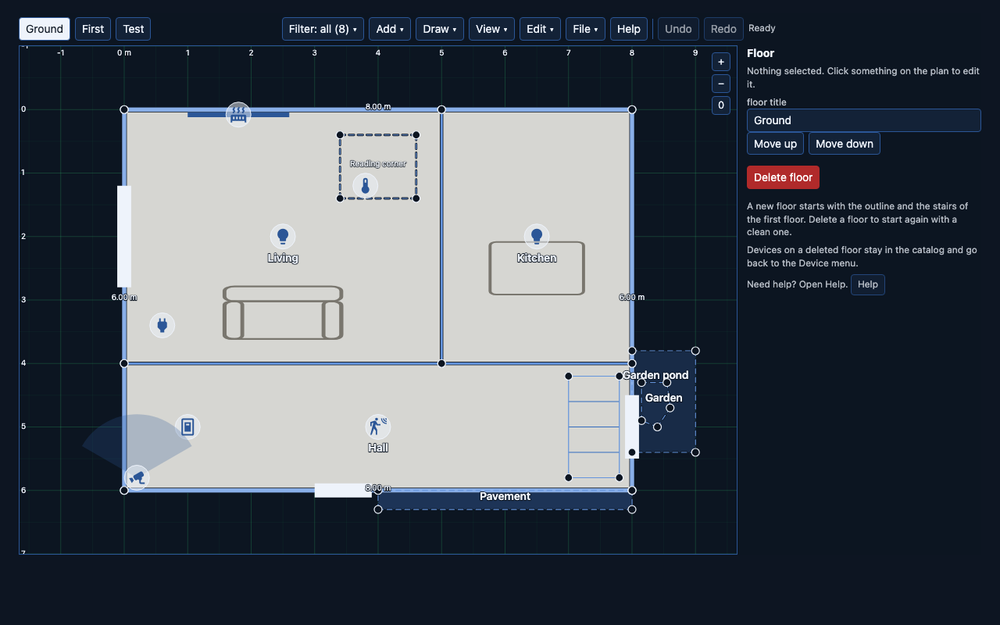
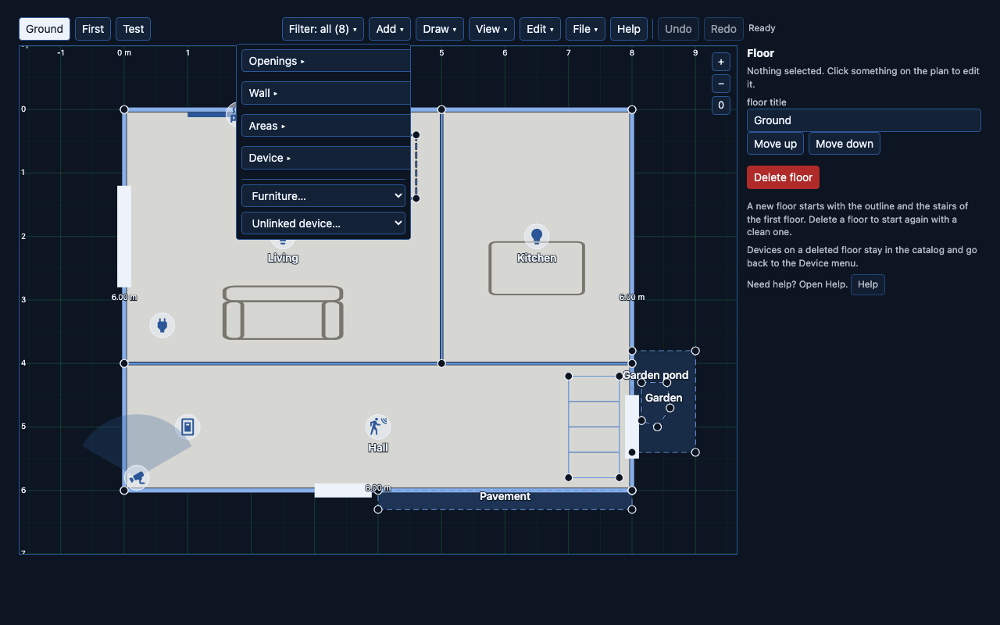
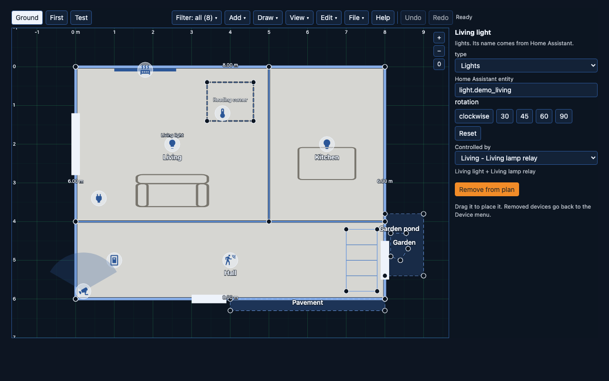

# The editor

Draw your home, floor by floor, and attach it to Home Assistant — walls,
rooms, doors, stairs, furniture, devices. Runs two places, same code:

- **Inside Home Assistant**, as a sidebar panel — draws, saves straight to
  `.storage`, and (where a writer is configured) reads and writes Home
  Assistant itself: areas, entities, helpers, groups, automations.
- **Standalone**, as `dist/editor.html` — open it directly from disk
  (`file://`), no server, no Home Assistant. Draws and exports/imports JSON
  files; nothing about Home Assistant is available here.

## The toolbar

Left to right:

- **Floor tabs** (`Ground`, `First`, ...) — switch floors. A new floor comes
  from Edit, Add floor: it starts with the outline and stairs of the first
  floor.
- **Filter: all (N)** — filters which device types are drawn, so a crowded
  plan can be thinned out while you work.
- **Add** — every drawable thing: openings (door, window, gap), a wall of a
  given kind, areas (zone, structure, stairs), furniture, an unlinked
  appliance icon, and (inside Home Assistant) entities from your instance.
  Device, inside Add, is the catalog of every device on this layout, placed
  or not.
- **Draw** — freehand outline/room drawing mode.
- **View** — how the plan looks while you work: the installed version at the
  top, then snap grid, measure grid, lengths, names, Preview night, theme,
  Re-center and Fit to window.
- **Edit** — what changes the plan or Home Assistant: Add floor, the Home
  Assistant popover (inside Home Assistant), Group, plan rotation, Device
  colours, Trace image…
- **File** — Save, Open, Export, Reset.
- **Help** — a step-by-step guide in the side panel, for someone who has
  never used the editor before. It stays open while you work, so you can
  follow a step and do it without the guide getting in the way. Escape or
  its own Close button puts the side panel back to normal.
- **Undo / Redo** — one step per gesture; a drag that ends back where it
  started adds no step.
- **Status line** — right of Redo: what just happened ("Saved", "Edited",
  an error). A long message is cut with an ellipsis; hover it for the full
  text.

## The side panel

Click anything on the plan — a room, a wall, a device, furniture, stairs — and
its panel replaces the default "Floor" panel on the right: what it is, its
fields, and a Delete button. Click empty canvas to go back to the floor panel.
Panels for entity-backed things (rooms with an area, devices) also show
Home Assistant context — the room's helpers and automations, a device's
more-info — where a writer is configured.

A device's panel shows one extra field for a few types:

- **Person** — a "Room sensor" field, below the entity field: point it at a
  second entity (a BLE room-presence sensor) whose state, or `area_id`/`area`
  attribute, names one of your rooms, and the card glides the icon there. It
  refuses the person's own entity, since that isn't a room sensor.
- **mmWave radar** — a "Targets" field: add or remove `x`/`y` entity pairs,
  one row per tracked target, each pointing at the two sensors an ESPHome
  LD2450 (or similar) exposes for that target.
- **Vacuum** — nothing extra; point `entity` at the `vacuum.*` entity. There
  is no field for the robot's position, since most integrations expose that
  as a camera or a proprietary blob, not coordinates.

## What Floorplan Studio made in Home Assistant

Inside Home Assistant, Edit, Home Assistant opens a small popover (drag it
by its head, close it with the X or Escape) listing every helper,
automation and area the editor created, labelled `floorplan-studio`, across
the whole instance. Click a name to open the item where Home Assistant edits
it: a helper's dialog, the automation editor, the area page. Remove deletes
it from Home Assistant after a confirmation; the plan is not touched either
way. The button is disabled while there is nothing to list.

## Placing a room's devices at once

Select a room linked to a Home Assistant area and the panel shows "Place N
Home Assistant devices" when the area has entities the plan does not show
yet. It opens a popup: one row per entity with a tick, and a chip per type
to narrow the list. Only what the plan has an icon for is offered: lights,
switches, plugs, sensors with a temperature, humidity, motion, contact or
vibration class, cameras, covers and the like. Power, energy, illuminance
and battery readings, groups, scripts and people are left out. Untick what
you do not want and press Place: the ticked rows land on free spots in the
room, one undo step, ready to drag to their real place.

## Drawing a house

1. **Draw the outline.** `Draw` starts freehand outline drawing; click each
   corner, double-click (or click the first corner again) to close it.
2. **Split it into rooms.** Draw a room the same way, snapped to the outline
   and to other rooms — a room's own edges default to `wall`.
3. **Doors and windows.** `Add → Openings` places one on the nearest wall
   within 15 cm; drag it along the wall afterwards.
4. **Stairs, zones, structures.** `Add → Areas`. A zone has no wall edges (it
   can't — `wk` is forced to `boundary` throughout); a structure can.
5. **Furniture and devices.** `Add → Furniture` places a symbol you can move,
   resize and rotate. `Add → Entities` (inside Home Assistant) or
   `Device → <unplaced item>` places something tied to a real entity.
6. **Attach an entity.** Select a device, pick it from the entity field in its
   panel. An entity already on the plan is never offered twice (its own
   stays).
7. **Save.** `File → Save` inside Home Assistant writes to `.storage`
   straight away. `File → Export` (either mode) downloads the JSON.

## Snapping and editing

A corner jumps onto another corner, a wall, or lines up with a neighbour.
Hold **Alt** while dragging to move freely, ignoring every snap. Drag a wall
to move it together with the corners on either end; hold **Shift** while
dragging a corner or a wall to move just that one, detached from its
neighbours. Drag a room, zone or stairs by its middle to move the whole
shape. **Delete** removes whatever is selected — corner, wall, door, opening,
device, furniture or stairs. **Ctrl/Cmd+Z** undoes, **Ctrl/Cmd+Shift+Z**
redoes. Scroll to zoom; pan by dragging the background, or drag anywhere with
the middle button, right button, or Ctrl/Cmd held.

The same text is in the editor under Help, step "Moving things and
snapping". The side panel no longer repeats it.

## Rotation

A device or a piece of furniture turns from its panel's rotation buttons —
30°, 45°, 60° or 90° per click, a direction toggle, and Reset to 0. There is
no free-text angle field: every angle the UI can produce is already wrapped
into `[0, 360)`. (A hand-edited layout file can still carry an angle outside
that range — the file loader normalises it on open, same treatment as an
out-of-range furniture size.)

## Preview night

View, Preview night toggles the same dark overlay the card shows after
sunset: every room and outdoor area darkens, and a room with a light on
stays clear. The editor has no live lights, so with the preview on every
room is dark. It's a browser preference, not part of the layout — it is
never saved with the plan and never becomes an undo step.

## Trace over a scan

Edit, Trace image… opens a small panel at the bottom left of the plan.

1. **Load image…** takes a PNG, JPEG or WebP: a scan, a photo of the
   estate agent's plan, an architect's drawing. It is shrunk to 2000 px on
   the long side and stored with the floor, then placed over the outline (or
   the middle of the view on a blank floor) at half opacity.
2. **Scale…**: click two points on the image whose real distance you know, a
   wall you have measured, say. Type that distance in cm and Apply. The image
   is resized so the two points are that far apart; its height follows.
3. Draw the outline and the rooms over it as usual. While the image is shown,
   room fills are see-through, so a room you have drawn does not hide the
   scan under it.
4. **Opacity** and **Show** change how much of it you see; **Remove image**
   drops it. Each change is one undo step.

Only the editor shows the image. The card never draws it, though Save keeps it
with the plan (up to 4 MB). File, Export leaves it out unless you tick
**Include trace image**, so a file you hand to an assistant stays small.

## Starting from photos instead

If you'd rather not draw the outline by hand, an AI assistant can trace it
from photos or an architect's drawing and hand you back a `layout.json` to
open here and correct. See the README's ["Start from photos or architect
drawings"](../README.md#start-from-photos-or-architect-drawings) section.

## Layout files

The editor's Open and Reset both run every file through the same `validate()`
the card uses — a file that doesn't pass is rejected with the reason, and
nothing on screen changes. A layout is [schema v2](schema.md); an older v1
file is migrated on open automatically. Because a layout file is something
anyone (or an LLM) can hand you, it's treated as untrusted: a missing field
gets a sane default, an out-of-range value gets clamped or wrapped rather
than crashing the load, and only `validate()` itself is the strict gate that
decides whether the result is usable.
